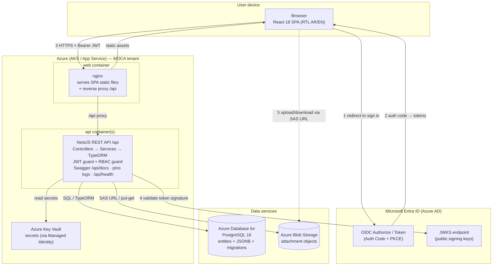

# 01 — System Architecture

**Sector Head Follow-up Platform (منصة متابعة رئيس القطاع) — MOCA**
Production (`it` branch) architecture overview.

---

## 1. Overview

The platform is a classic **three-tier web application** hardened for UAE government
production:

1. **Presentation** — a Vite + React 18 + TypeScript single-page app (SPA), served as
   static files by **nginx** behind a reverse proxy. Arabic RTL-first, bilingual AR/EN.
2. **Application** — a **Node.js + NestJS** REST API under `/api`, layered as
   Controllers → Services → TypeORM repositories, protected by a global JWT auth guard
   and an RBAC guard.
3. **Data** — **PostgreSQL 16** for structured/relational + JSONB data, and **Azure Blob
   Storage** for file attachments (only keys/URLs live in the DB).

**Identity** is delegated to **Microsoft Entra ID (Azure AD)** using OpenID Connect
(Authorization Code + PKCE). The backend never sees a password; it validates
Entra-issued JWT access tokens against Entra's JWKS. Application roles/permissions are
stored in the app DB, keyed by each user's Entra object id (`oid`).

---

## 2. Architecture diagram

**Trust boundaries:** the browser is untrusted; nginx terminates TLS and is the only
public ingress; the API and databases sit on a private network. Only nginx (`:443`) and,
for interactive sign-in, Entra are reachable from the public internet.

---

## 3. Component responsibilities

| Component | Responsibility | Notes |
|---|---|---|
| **Browser SPA** (React 18 + TS) | Renders all screens, handles routing, RTL/i18n, holds the Entra access token in memory, calls `/api`. Gates nav/actions client-side via the permission model (UX only). | Client-side checks are convenience; the API is the real authority. |
| **nginx** (web container) | Serves the built SPA static bundle; reverse-proxies `/api/*` to the NestJS container; terminates TLS; sets security headers (HSTS, CSP, X-Frame-Options); SPA history fallback. | Single public entry point. |
| **NestJS API** (api container) | REST endpoints under `/api`; **global JWT auth guard** validates Entra tokens; **RBAC guard** enforces section×action grants; business logic in Services; persistence via TypeORM repositories; issues Blob SAS URLs; emits pino logs with request-id; exposes `/api/health` and Swagger `/api/docs`. | Stateless — horizontally scalable. |
| **PostgreSQL 16** | System of record for all domain entities; nested/variable structures (project timeline, finModel breakdowns, committee scores) stored as **JSONB**; schema evolved via TypeORM migrations. | Managed (Flexible Server) in prod. |
| **Azure Blob Storage** | Stores attachment file objects; DB holds only the blob key/URL. Uploads/downloads use short-lived SAS URLs so bytes bypass the API. | One container per environment. |
| **Microsoft Entra ID** | Identity provider; authenticates users (Auth Code + PKCE), issues ID + access tokens; publishes JWKS for signature validation. | No local passwords anywhere. |
| **Azure Key Vault** | Central secret store (DB password, API client secret, Blob keys); API reads via Managed Identity. | No secrets in images or plain env in prod. |

---

## 4. Technology stack

| Layer | Technology | Version / notes |
|---|---|---|
| Frontend framework | React | 18.3 |
| Build tool | Vite | 5.4 |
| Language (FE + BE) | TypeScript | 5.6 |
| FE state | Zustand | client cache / UI state |
| Fonts / RTL | IBM Plex Sans Arabic, logical CSS props | RTL-first |
| Backend framework | NestJS (Node.js) | REST, DI, guards, interceptors |
| Runtime | Node.js | LTS (20+) |
| ORM | TypeORM | entities + SQL migrations |
| Database | PostgreSQL | 16 (JSONB for nested data) |
| Object storage | Azure Blob Storage | attachments |
| Auth | Microsoft Entra ID (OIDC) | Auth-Code + PKCE, JWT/JWKS |
| API docs | Swagger / OpenAPI | `/api/docs` |
| Logging | pino (structured JSON) | request-id correlation |
| Reverse proxy | nginx | TLS, static, `/api` proxy |
| Containerization | Docker + docker-compose | local: postgres + api + web + adminer |
| Orchestration (prod) | Azure Kubernetes Service **or** App Service | see §6 |
| Secrets | Azure Key Vault | Managed Identity |
| DB (prod) | Azure Database for PostgreSQL Flexible Server | v16 |

---

## 5. Environments

| Aspect | Dev (local) | Staging | Production |
|---|---|---|---|
| Runs on | Developer laptop, docker-compose | Azure (AKS/App Service) | Azure (AKS/App Service) |
| Web URL | `http://localhost:8080` | `https://sectorhead-stg.moca.gov.ae` | `https://sectorhead.moca.gov.ae` |
| API | `http://localhost:3000/api` | `.../api` | `.../api` |
| Database | Postgres container | Azure PostgreSQL (staging) | Azure PostgreSQL (prod, HA) |
| Blob | Azurite / dev container | Blob (staging container) | Blob (prod container) |
| Entra app | Dev app registration (localhost redirect) | Staging registration | Prod registration |
| Secrets | `.env` file | Key Vault (staging) | Key Vault (prod) |
| Swagger `/api/docs` | Enabled | Enabled (protected) | **Disabled / restricted** |
| Log level | `debug` | `info` | `info` / `warn` |
| Seed data | Full demo seed | Sanitized real subset | Real data only |

Promote **dev → staging → prod** by the same image (immutable tags); only config/secrets
differ per environment.

---

## 6. Network & ports

| Flow | Source → Destination | Port / protocol | Exposure |
|---|---|---|---|
| User → web | Browser → nginx | 443 HTTPS (80 → 301 redirect) | Public |
| Sign-in | Browser → Entra | 443 HTTPS | Public (Microsoft) |
| SPA → API | Browser → nginx `/api` → NestJS | 443 → internal 3000 | Public edge only |
| API → Postgres | NestJS → PostgreSQL | 5432 (private) | Private network only |
| API → Blob | NestJS → Azure Blob | 443 HTTPS (private endpoint) | Private endpoint |
| Browser → Blob | Browser → Blob via SAS URL | 443 HTTPS | Scoped, time-limited |
| API → JWKS | NestJS → Entra JWKS | 443 HTTPS (cached) | Outbound |
| API → Key Vault | NestJS (Managed Identity) → Key Vault | 443 HTTPS | Private |
| Health probe | Orchestrator → NestJS | `/api/health` (3000) | Internal |
| Local dev only | Adminer → Postgres | 8081 / 5432 | Local only |

Only **443 on nginx** is internet-facing in production. Postgres (`5432`) is never
publicly exposed.

---

## 7. Scaling & availability

- **Stateless API:** the NestJS container holds no session state (tokens are validated
  per-request against cached JWKS), so it scales **horizontally** — add replicas behind
  the ingress/load balancer. Target CPU-based autoscaling on AKS (HPA) or scale-out rules
  on App Service.
- **Web tier:** nginx serving static assets is cheap and also scales horizontally; assets
  are cacheable and can front a CDN (Azure Front Door) for edge caching.
- **Database:** vertical scale first (Flexible Server compute/storage tiers); enable a
  **read replica** for reporting-heavy read load if needed; use PgBouncer/connection
  pooling to protect connection limits under many API replicas.
- **Blob storage** scales independently and effectively without limit; keeping bytes out
  of the API (SAS URLs) removes attachment throughput from the app tier.
- **High availability:** run ≥2 API and ≥2 web replicas across availability zones;
  PostgreSQL Flexible Server with **zone-redundant HA**; Blob with geo-redundant
  replication (GRS/RA-GRS) for DR.
- **Statelessness caveats:** any in-memory caches (JWKS keys, permission lookups) must be
  safe to rebuild on any replica; nothing user-specific may be pinned to a single pod.
- **Graceful rollout:** immutable image tags + rolling deployments; readiness gated on
  `/api/health` so traffic only reaches ready replicas.

---

## 8. Cross-cutting concerns

| Concern | Approach |
|---|---|
| **AuthN** | Entra OIDC (Auth-Code + PKCE); JWT validated via JWKS (issuer, audience, exp, signature). |
| **AuthZ** | DB-stored roles keyed by Entra `oid`; RBAC guard enforces section×action grants (doc 03). |
| **Audit trail** | `changeLog` entity records edits (who/what/from/to/note); mirrors the SPA change log. |
| **i18n / RTL** | Arabic RTL-first with EN toggle; data values localized in the SPA; API returns canonical (mostly Arabic) domain strings. |
| **Observability** | pino structured logs + request-id correlation; `/api/health`; metrics/alerts via Azure Monitor. |
| **Config** | 12-factor: all config via env vars; secrets via Key Vault; nothing hardcoded. |
| **API contract** | OpenAPI/Swagger at `/api/docs`; the domain model in `app/src/data/types.ts` is the source of truth for entity shapes. |
