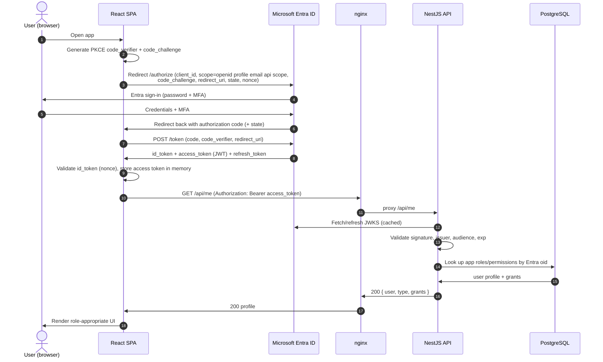
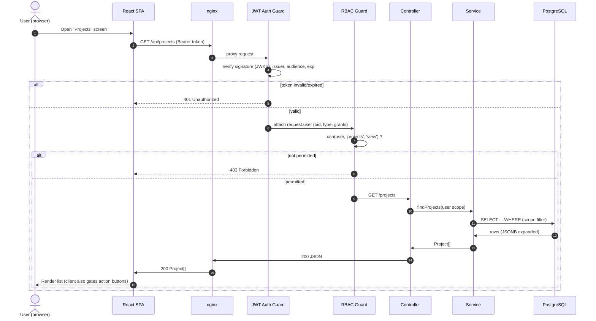
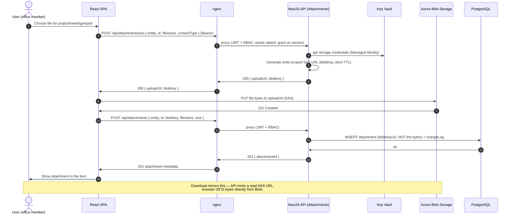

# 02 — Data Flow & Request Lifecycle

**Sector Head Follow-up Platform — MOCA (production `it` branch)**

This document traces how requests move through the system: SSO login, an authenticated
read, a Sector Head approval action, and a file upload — plus the token-validation and
RBAC-enforcement narrative that applies to every call.

---

## 1. SSO login — OIDC Authorization Code + PKCE (Microsoft Entra ID)

The SPA is a public client, so it uses the Authorization Code flow **with PKCE** (no
client secret in the browser). Entra issues the tokens; the API only ever validates them.



**Notes**
- `state` protects against CSRF on the redirect; `nonce` binds the id_token to this
  session; `code_challenge/verifier` (PKCE) protects the auth code in transit.
- The **access token** is the credential the API trusts; the **id_token** is only for the
  SPA to learn who signed in.
- If the user has no row in the app DB for their `oid`, the API returns `403` (or a
  provisioning path per policy) — **being authenticated in Entra is not the same as being
  authorized in the app**.
- Token refresh uses the refresh token silently; the SPA never stores tokens in
  `localStorage` (memory only) to reduce XSS exposure.

---

## 2. Authenticated API read

Every data call carries the Bearer token and passes both guards before reaching a service.



**Scope filtering:** for `sector` users the service also filters rows to their
department scope (e.g. `admin_affairs`) — authorization is both *section×action* (may I
view projects?) and *scope* (which projects?).

---

## 3. Project approval by the Sector Head (اعتماد / إرجاع)

Approvals apply **only** to projects, leaves, and meeting requests, and **only the chair**
may approve. Here the Sector Head approves a project completion (or a deadline extension).

```mermaid
sequenceDiagram
    autonumber
    actor CH as Sector Head (chair)
    participant SPA as React SPA
    participant N as nginx
    participant JWT as JWT Auth Guard
    participant RBAC as RBAC Guard
    participant S as Projects Service
    participant DB as PostgreSQL

    Note over CH,DB: Office member earlier submitted the item →<br/>status = "بانتظار اعتماد رئيس القطاع" (pending)
    CH->>SPA: Click "اعتماد" (approve) [or "إرجاع" with reason]
    SPA->>N: POST /api/projects/:id/approve { decision, note? } (Bearer)
    N->>JWT: proxy
    JWT->>JWT: Validate token
    JWT->>RBAC: request.user (type=chair)
    RBAC->>RBAC: can(user,'projects','approve') AND user.type=='chair'
    alt not chair
        RBAC-->>SPA: 403 Forbidden (approval is chair-only)
    else chair
        RBAC->>S: approveProject(id, decision, note)
        S->>DB: BEGIN
        S->>DB: UPDATE project SET status = 'معتمد' (or 'أعيد للتعديل')
        S->>DB: INSERT changeLog (by=chair oid, from='بانتظار...', to='معتمد', note)
        S->>DB: INSERT notification (owner = submitter)
        S->>DB: COMMIT
        DB->>S: ok
        S->>N: 200 { status }
        N->>SPA: 200 updated project
        SPA->>CH: Show new status; notify the submitting member
    end
```

**Approval invariants**
- The RBAC guard hard-checks `user.type === 'chair'` for any `approve` action — a mistaken
  `p` grant on a non-chair user must still be rejected server-side.
- Approve/return is transactional with the **change-log** and **notification** writes, so
  the audit trail can never diverge from the item's status.
- Canonical statuses (`بانتظار اعتماد رئيس القطاع` → `معتمد` / `أعيد للتعديل`) come from
  `app/src/domain/workflow.ts`; the backend must accept the documented legacy aliases when
  reading and normalize to canonical on write.
- **Documents/reports are never routed here** — they have no approve endpoint (view-only /
  اطلاع for the chair).

---

## 4. File attachment upload to Azure Blob

Bytes go **directly** browser↔Blob via a short-lived SAS URL; the API only mints the URL
and records the resulting key. This keeps large uploads off the app tier.



**Notes**
- Only the **key/URL and metadata** are stored in Postgres — never the file blob.
- SAS URLs are **scoped** (single blob, read-or-write, short TTL) so a leaked URL expires
  quickly and cannot enumerate other files.
- The `attach` (letter `m`) grant is required on the target section for the RBAC guard to
  allow SAS minting (doc 03).

---

## 5. Request lifecycle (applies to every `/api` call)

```mermaid
flowchart LR
    A["Browser: fetch /api/...<br/>Authorization: Bearer JWT"] --> B["nginx: TLS, security headers,<br/>proxy /api → NestJS"]
    B --> C["Request-ID interceptor<br/>(generate/propagate x-request-id)"]
    C --> D["JWT Auth Guard<br/>validate signature/issuer/aud/exp via JWKS"]
    D -->|invalid| Z1["401"]
    D -->|valid| E["Load user by oid<br/>(type + grants + scope)"]
    E --> F["RBAC Guard<br/>can(user, section, action) + scope"]
    F -->|denied| Z2["403"]
    F -->|allowed| G["Controller"]
    G --> H["Service (business rules,<br/>transactions, change-log)"]
    H --> I["TypeORM repository → Postgres<br/>(+ Blob SAS when needed)"]
    I --> J["Response DTO"]
    J --> K["pino log line<br/>{request-id, oid, route, status, ms}"]
    K --> L["JSON back through nginx"]
```



### 5.1 Token validation (JWKS)

1. On startup / first use, the API fetches Entra's **JWKS** (public signing keys) and
   caches them (with periodic refresh + on-`kid`-miss refetch).
2. For each request, the JWT Auth Guard checks: **signature** (against the matching JWKS
   key by `kid`), **issuer** (`iss` = the tenant's Entra issuer), **audience** (`aud` =
   the API's client-id / App ID URI), and **expiry** (`exp`/`nbf`).
3. On success the guard attaches a `request.user` built from the token claims (`oid`,
   `preferred_username`, name) plus the app-DB lookup (type, grants, scope).
4. Any failure short-circuits with **401** before controllers run. No token = no access;
   `/api/health` is the only unauthenticated route.

### 5.2 RBAC enforcement

- Authorization is the model from `app/src/domain/permissions.ts`: **user type** ×
  **section** × **action grant letter** (`v a e d m s r n p`) × **scope**.
- The RBAC guard reads route metadata (e.g. `@RequirePermission('projects','approve')`)
  and calls the server-side equivalent of `can(user, section, action)`.
- `chair` (Sector Head) and users flagged `all` pass all section/action checks; every
  other user is checked against their stored grant letters.
- **Approval hard rule:** the `approve` action additionally requires `user.type ===
  'chair'` and a section in {projects, leaves, meeting-requests}. No other type/section
  can approve — this is enforced server-side regardless of client state.
- **Scope:** for `sector` users, services add a WHERE-clause filter to their department
  scope so they only see/act on their own unit's records.
- The client performs the **same** checks to hide buttons/nav for UX, but the **server is
  authoritative** — a hand-crafted request from a lesser role is still rejected.
- Every mutating call writes a **changeLog** row (actor `oid`, section, item, from→to,
  note) so the audit trail matches the SPA's change-log behavior.
