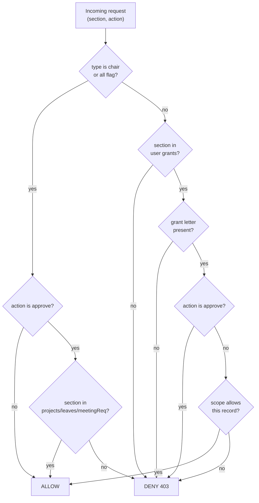
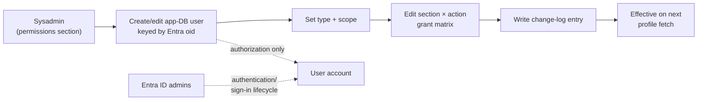

# 03 — Roles & Responsibilities (RBAC)

**Sector Head Follow-up Platform — MOCA (production `it` branch)**

The authorization model is defined in `app/src/domain/permissions.ts` and is the
authoritative contract for the backend RBAC guard. This document explains the model,
lists the exact permissions for every seed user, maps the real people to their duties
(RACI), and describes how the system admin manages roles.

---

## 1. The RBAC model

Authorization is a four-dimensional model:

```
  who (user TYPE)  ×  where (SECTION)  ×  what (ACTION grant)  ×  how far (SCOPE)
```

### 1.1 User types

| Type | Arabic | English | Authority |
|---|---|---|---|
| `chair` | رئيس القطاع | Sector Head | Full view/review/**approve**/direct; final approval authority; grants & revokes permissions. |
| `office` | فريق مكتب رئيس القطاع | Chair Office Team | Data entry, status updates, attachments, send-for-review — **only** where granted. |
| `sector` | مدراء القطاع / الإدارات | Sector / Dept. Managers | Send updates/reports/notes **within their department scope only** — limited access. |
| `sysadmin` | مدير النظام | System Admin | Manage users/roles/permissions/lists/statuses/change-log — **cannot approve** operational items. |

### 1.2 Action grants (letters)

| Letter | Action key | Arabic | English |
|---|---|---|---|
| `v` | view | عرض | View |
| `a` | add | إضافة | Add |
| `e` | edit | تعديل | Edit |
| `d` | del | حذف | Delete |
| `m` | attach | رفع مرفق | Attach file |
| `s` | status | تغيير الحالة | Change status |
| `r` | review | إرسال للمراجعة | Send for review |
| `n` | note | إضافة ملاحظة | Add note |
| `p` | approve | اعتماد | **Approve** (chair only) |

A user's grant for a section is a string of these letters (e.g. `vaemsrn` = view + add +
edit + attach + status + review + note).

### 1.3 Sections (22)

`dashboard`, `projects`, `projPhases`, `projUpdates`, `projRisks`, `meetings`, `minutes`,
`minuteTasks`, `committees`, `committeeDecisions`, `correspondence`, `myTasks`,
`reportCenter`, `reportLog`, `finReports`, `auditReports`, `recommendations`, `leaves`,
`assistant`, `permissions`.

### 1.4 Scopes

| Scope | Arabic | English |
|---|---|---|
| `all` | كامل القطاع | Whole sector |
| `office` | مكتب رئيس القطاع | Sector Head Office |
| `admin_affairs` | إدارة الشؤون الإدارية | Admin Affairs |
| `hr` | إدارة خدمات الموارد البشرية | HR Services |
| `digital` | الخدمات الذكية والبنية الرقمية | Digital & Infrastructure |
| `cx` | مركز التجربة المتكاملة | Integrated Experience Center |

### 1.5 Resolution rules (`effectivePerms` / `can`)

- If `type === 'chair'` **or** the user is flagged `all`, the user gets **every action on
  every section** (subject to the approval rule below).
- Otherwise, the user's effective permissions are exactly the letters in their per-section
  grant map `g`; a section absent from `g` is fully denied (not even view).
- `can(user, section, action)` returns true only if the section's grant string contains
  that action's letter.
- **Approval hard rule:** `approve` (`p`) is meaningful only for `chair` and only on
  `projects`, `leaves`, and meeting requests. The backend guard must enforce
  `user.type === 'chair'` for any approve, regardless of stored letters.



---

## 2. Permission matrix — per seed user

Legend: **V**iew · **A**dd · **E**dit · **D**el · attac**H** · **S**tatus · **R**eview ·
**N**ote · a**P**prove. A blank cell = no access to that section.

### 2.1 فوزية الطاير — Sector Head (`chair`, scope: all)

**Full access to all 22 sections with every action (V A E D H S R N P).** Sole approval
authority for projects, leaves, and meeting requests.

### 2.2 موزة المرزوقي — Correspondence & follow-ups (`office`, scope: office)

| Section | Grants |
|---|---|
| dashboard | V |
| correspondence | V A E · H S R N |
| myTasks | V E |
| projects | V |
| reportCenter | V |
| committees | V |
| assistant | V |

*(correspondence = `vaemsrn`: view, add, edit, attach, status, review, note — no delete, no approve.)*

### 2.3 سماح أبو شرخ — Minutes, committees, recommendations, leaves (`office`, scope: all)

| Section | Grants |
|---|---|
| dashboard | V |
| meetings | V A E · R |
| minutes | V A E · H · R N |
| minuteTasks | V A E · S |
| committees | V A E · H · R |
| committeeDecisions | V A E · R |
| recommendations | V A E · R |
| leaves | V A E · H S R N |
| myTasks | V E |
| assistant | V |

### 2.4 فاطمه الرشيدى — Projects & executive coordination (`office`, scope: office)

| Section | Grants |
|---|---|
| dashboard | V |
| projects | V A E · H S R N |
| projPhases | V A E |
| projUpdates | V A E · R |
| projRisks | V A E |
| myTasks | V E |
| reportCenter | V |
| meetings | V |
| minutes | V |
| assistant | V |

### 2.5 هاجر هلول — Achievement/follow-up & financial reports (`office`, scope: office)

| Section | Grants |
|---|---|
| dashboard | V |
| finReports | V A E · H · R N |
| reportLog | V A E |
| projUpdates | V A E · R |
| myTasks | V E |
| projects | V |
| assistant | V |

### 2.6 سيف بيضاني — Projects, phases, risks (`office`, scope: office)

| Section | Grants |
|---|---|
| dashboard | V |
| projects | V A E · H S R N |
| projPhases | V A E |
| projUpdates | V A E · R |
| projRisks | V A E |
| myTasks | V E |
| reportCenter | V |
| assistant | V |

### 2.7 حسن همام — Quality, compliance & audit (`office`, scope: all)

| Section | Grants |
|---|---|
| dashboard | V |
| auditReports | V A E · H · R N |
| recommendations | V A E · S R |
| committees | V E |
| reportCenter | V E |
| myTasks | V E |
| assistant | V |

### 2.8 راشد النعيمي — Manager, Admin Affairs (`sector`, scope: admin_affairs)

| Section | Grants |
|---|---|
| dashboard | V |
| projects | V · R N |
| reportCenter | V |
| correspondence | V |
| assistant | V |

*All access is additionally scoped to the **Admin Affairs** department only.*

### 2.9 مدير النظام — System Admin (`sysadmin`, scope: all)

| Section | Grants |
|---|---|
| dashboard | V |
| permissions | V A E D · S |
| assistant | V |

*No operational sections, and no `approve` anywhere.*

---

## 3. RACI — people ↔ operational responsibilities

**R** = Responsible (does the work) · **A** = Accountable (final owner/approver) ·
**C** = Consulted · **I** = Informed. The Sector Head (فوزية الطاير) is **Accountable**
for all operational outputs and is the sole **Approver** of projects, leaves, and meeting
requests.

| Operational area | فوزية (Chair) | موزة | سماح | فاطمه | هاجر | سيف | حسن | راشد | Sysadmin |
|---|---|---|---|---|---|---|---|---|---|
| Correspondence (صادر/وارد) | A/Approve-n/a | **R** | | | | | | C (Admin Affairs) | |
| Meetings & minutes | A | | **R** | C | | | | | |
| Minute-tasks | A | | **R** | | | | | | |
| Committees & decisions | A | I | **R** | | | C | C | | |
| Recommendations (توصيات) | A | | R | | | | **R** | | |
| Team leave planning | **A/Approve** | | **R** | | | | | I | |
| Projects — coordination | A | I | | **R** | C | R | | C (scope) | |
| Project phases & risks | A | | | R | | **R** | | | |
| Project updates | A | | | R | **R** | R | | | |
| **Project approval** (completion/extension) | **A/Approve** | | | R (submit) | | R (submit) | | | |
| Financial reports | A | | | | **R** | | | | |
| Regulatory report log | A | | | | **R** | | | | |
| Follow-up / audit reports | A | | | | | | **R** | | |
| Retained-payments reports | A | | | | R | | C | | |
| Report Center (aggregation) | A | I | | I | R | R | R | I | |
| Users / roles / permissions | A (policy) | | | | | | | | **R** |
| Executive assistant | (all view) | | | | | | | | |

Notes:
- "Submit" = the office member sends the item for the chair's approval; only the **chair
  approves**.
- `sector` manager (راشد) is Consulted/Informed within **Admin Affairs** scope only.
- The **sysadmin** is Responsible for identity/permissions administration but is
  **Informed only** on operations — never an approver.

---

## 4. How the system admin manages roles

The `sysadmin` (مدير النظام) owns the `permissions` section (grants `V A E D S`) and
**nothing operational**. Responsibilities:

1. **Provision users** — create the app-DB user record for each person, keyed by their
   **Entra object id (`oid`)**. Entra handles authentication; the app DB holds the
   authorization (type, scope, grants). No local passwords are ever created.
2. **Assign a user type** — `chair`, `office`, `sector`, or `sysadmin`.
3. **Set the scope** — `all`, `office`, or a specific department (`admin_affairs`, `hr`,
   `digital`, `cx`) for `sector` managers.
4. **Edit the section-permission matrix** — for `office`/`sector` users, set the grant
   letters per section (the 22×9 matrix mirrored in the SPA permissions screen).
5. **Grant/revoke** individual actions and **change item statuses** where the workflow
   is stuck (the `S` grant), all recorded in the change log.
6. **Deactivate / offboard** users (revoke app access; Entra sign-in removal is handled in
   Entra by identity admins).

**Hard constraints on the sysadmin:**
- Cannot grant themselves or anyone a working `approve` on operational items — the guard
  ties `approve` to `type === 'chair'`.
- Every permission change is written to the **change log** (who/what/from/to) for audit.
- Role/permission changes take effect on the user's next token/profile fetch.



---

## 5. Golden rule — approvals

> **Only the Sector Head (`chair`, فوزية الطاير) approves — and only projects, team
> leaves, and meeting requests.** All documents and reports (correspondence, minutes,
> financial, audit, retained-payments, regulatory log, etc.) are **view-only (اطلاع)** for
> the Sector Head; there is **no document approval workflow**. The office team produces
> them; the chair views, notes, and directs. The `sysadmin` never approves anything
> operational. The backend RBAC guard enforces this independently of any client state.
