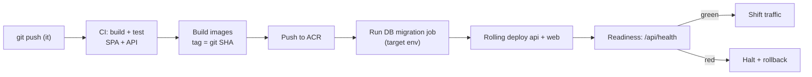
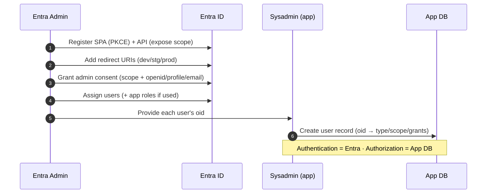

# 04 — Deployment Runbook

**Sector Head Follow-up Platform — MOCA (production `it` branch)**

Step-by-step operations guide: prerequisites, configuration, local run, migrations,
image builds, Azure deployment, health checks, rollback, backup/restore, secrets, and the
Microsoft Entra app-registration checklist.

> **Do not put real secrets in this repo.** All examples use placeholders. Real values
> live in Azure Key Vault (prod/staging) or a local, git-ignored `.env` (dev only).

---

## 1. Prerequisites

| Tool / resource | Purpose |
|---|---|
| Docker + Docker Compose | Local run and image builds |
| Node.js LTS (20+) + npm | Building the SPA and API locally |
| Azure CLI (`az`) | Provisioning and deployment |
| `kubectl` + Helm (AKS option) | Kubernetes deployment |
| PostgreSQL client (`psql`) | Migrations / backup / restore |
| Access to the **MOCA Entra tenant** | App registrations, admin consent |
| Azure subscription roles | Contributor on the resource group; Key Vault Secrets Officer |

Azure resources to have (or provision — §6):
- Resource group, Azure Container Registry (ACR)
- Azure Kubernetes Service **or** App Service (Linux containers)
- Azure Database for PostgreSQL Flexible Server (v16)
- Azure Storage account + Blob container
- Azure Key Vault
- Log Analytics workspace (Azure Monitor)

---

## 2. Environment variables (backend)

The NestJS API is 12-factor: **all** configuration comes from environment variables. In
prod/staging these are injected from Key Vault; in dev from a git-ignored `.env`.

### 2.1 Core / server

| Variable | Example / placeholder | Notes |
|---|---|---|
| `NODE_ENV` | `production` | `development` \| `staging` \| `production` |
| `PORT` | `3000` | API listen port (behind nginx) |
| `API_BASE_PATH` | `/api` | Global route prefix |
| `CORS_ORIGINS` | `https://sectorhead.moca.gov.ae` | Comma-separated allowed origins |
| `LOG_LEVEL` | `info` | pino level (`debug` in dev) |
| `SWAGGER_ENABLED` | `false` | `true` in dev/staging; **false/restricted in prod** |

### 2.2 Microsoft Entra ID (authentication)

| Variable | Example / placeholder | Notes |
|---|---|---|
| `ENTRA_TENANT_ID` | `00000000-0000-0000-0000-000000000000` | Directory (tenant) ID |
| `ENTRA_API_CLIENT_ID` | `<api-app-client-id>` | The API app registration's client id (token **audience**) |
| `ENTRA_API_CLIENT_SECRET` | `<from Key Vault>` | API confidential-client secret (Key Vault only) |
| `ENTRA_SPA_CLIENT_ID` | `<spa-app-client-id>` | SPA public-client id (informational / token exchange) |
| `ENTRA_REDIRECT_URI` | `https://sectorhead.moca.gov.ae/auth/callback` | Must match the Entra registration exactly |
| `ENTRA_ISSUER` | `https://login.microsoftonline.com/<tenant-id>/v2.0` | Expected `iss` claim |
| `ENTRA_JWKS_URI` | `https://login.microsoftonline.com/<tenant-id>/discovery/v2.0/keys` | Public signing keys |
| `ENTRA_AUDIENCE` | `api://<api-app-client-id>` | Expected `aud` (App ID URI or client id) |
| `ENTRA_API_SCOPE` | `api://<api-app-client-id>/access_as_user` | Scope the SPA requests |

> The SPA also needs the public values at build/runtime: `ENTRA_TENANT_ID`,
> `ENTRA_SPA_CLIENT_ID`, `ENTRA_REDIRECT_URI`, `ENTRA_API_SCOPE`. These are **not**
> secrets. The **client secret is server-side only.**

### 2.3 Database (PostgreSQL)

| Variable | Example / placeholder | Notes |
|---|---|---|
| `DB_HOST` | `moca-pg.postgres.database.azure.com` | Flexible Server host |
| `DB_PORT` | `5432` | |
| `DB_NAME` | `sectorhead` | Database name |
| `DB_USER` | `sh_app` | Least-privilege app user |
| `DB_PASSWORD` | `<from Key Vault>` | Never in the image |
| `DB_SSL` | `true` | Azure PostgreSQL requires TLS |
| `DB_POOL_MAX` | `10` | Per-replica pool size |
| `DB_MIGRATIONS_RUN` | `false` | Run migrations as an explicit job, not on boot |

### 2.4 Azure Blob Storage (attachments)

| Variable | Example / placeholder | Notes |
|---|---|---|
| `BLOB_ACCOUNT_NAME` | `mocasectorhead` | Storage account name |
| `BLOB_CONTAINER` | `attachments` | Container for files |
| `BLOB_ACCOUNT_KEY` | `<from Key Vault>` | Or prefer Managed Identity (below) |
| `BLOB_USE_MANAGED_IDENTITY` | `true` | Preferred: no key in config |
| `BLOB_SAS_TTL_MINUTES` | `15` | Lifetime of upload/download SAS URLs |

### 2.5 Secrets / Key Vault

| Variable | Example / placeholder | Notes |
|---|---|---|
| `KEYVAULT_URI` | `https://moca-sh-kv.vault.azure.net/` | Key Vault endpoint |
| `AZURE_CLIENT_ID` | `<managed-identity-client-id>` | User-assigned Managed Identity (if used) |

An example template lives at `infra/.env.example` — copy to `.env` for local dev.

---

## 3. Local run (docker-compose)

`infra/docker-compose.yml` brings up four services: **postgres**, **api** (NestJS),
**web** (nginx + SPA), and **adminer** (DB UI).

```bash
git checkout it
cp infra/.env.example .env        # fill DB_*, ENTRA_* (dev app reg), BLOB_* (or Azurite)
docker compose -f infra/docker-compose.yml up -d --build

# 1) apply the schema
docker compose exec api npm run migration:run

# 2) (optional) load seed/reference data
docker compose exec api npm run seed

# 3) verify
curl http://localhost:3000/api/health        # -> { status: "ok" }
open http://localhost:8080                    # SPA via nginx
open http://localhost:3000/api/docs           # Swagger (dev)
open http://localhost:8081                    # Adminer (DB)
```

Local endpoints:

| Service | URL |
|---|---|
| Web (SPA via nginx) | `http://localhost:8080` |
| API | `http://localhost:3000/api` |
| Swagger | `http://localhost:3000/api/docs` |
| Health | `http://localhost:3000/api/health` |
| Adminer | `http://localhost:8081` (server `postgres`, db `sectorhead`) |

For dev SSO, register a **dev** Entra app with redirect `http://localhost:8080/auth/callback`.

---

## 4. Database migrations (TypeORM)

Migrations are **explicit** — never auto-run on API boot in shared environments.

```bash
# generate a migration from entity changes (dev)
docker compose exec api npm run migration:generate --name=add_projects_index

# apply pending migrations
npm run migration:run          # local: docker compose exec api npm run migration:run

# revert the last migration
npm run migration:revert

# show status
npm run migration:show
```

**In Azure**, run migrations as a **one-off job / init container** against the target DB
*before* routing traffic to new API replicas:

```bash
# AKS: run a job that executes the migration entrypoint
kubectl apply -f infra/k8s/migrate-job.yaml
kubectl logs job/sectorhead-migrate -f
# App Service: run via SSH/console or a deployment pre-step
az webapp ssh -g <rg> -n <api-app> --command "npm run migration:run"
```

Rule: **migrate first, then deploy the app image that expects the new schema.** Keep
migrations backward-compatible for one release to allow safe rollback (expand/contract).

---

## 5. Building images

```bash
# from repo root
docker build -t <acr>.azurecr.io/sectorhead-api:<tag> -f server/Dockerfile server
docker build -t <acr>.azurecr.io/sectorhead-web:<tag> \
  --build-arg ENTRA_SPA_CLIENT_ID=<spa-id> \
  --build-arg ENTRA_TENANT_ID=<tenant-id> \
  --build-arg ENTRA_REDIRECT_URI=<uri> \
  --build-arg ENTRA_API_SCOPE=<scope> \
  -f infra/web/Dockerfile .

# push to Azure Container Registry
az acr login -n <acr>
docker push <acr>.azurecr.io/sectorhead-api:<tag>
docker push <acr>.azurecr.io/sectorhead-web:<tag>
```

Use **immutable tags** (git SHA or semver). The `web` image bundles the built SPA and the
nginx config that proxies `/api` to the API service.

---

## 6. Deploying to Azure

Two supported options — pick per MOCA platform standards.

### Option A — Azure App Service (containers)

Simpler ops; good for moderate scale.

```bash
# resources (once)
az group create -n <rg> -l uaenorth
az acr create -n <acr> -g <rg> --sku Standard
az postgres flexible-server create -g <rg> -n moca-pg --version 16 \
  --tier GeneralPurpose --high-availability ZoneRedundant --storage-size 128
az storage account create -n mocasectorhead -g <rg> --sku Standard_ZRS
az keyvault create -n moca-sh-kv -g <rg>

# two web apps: api + web (or one app hosting web that proxies to api)
az webapp create -g <rg> -p <plan> -n sectorhead-api --deployment-container-image-name <acr>.azurecr.io/sectorhead-api:<tag>
az webapp create -g <rg> -p <plan> -n sectorhead-web --deployment-container-image-name <acr>.azurecr.io/sectorhead-web:<tag>

# app settings from Key Vault references (no plaintext secrets)
az webapp config appsettings set -g <rg> -n sectorhead-api --settings \
  NODE_ENV=production PORT=3000 \
  DB_HOST=... DB_NAME=sectorhead DB_USER=sh_app DB_SSL=true \
  DB_PASSWORD="@Microsoft.KeyVault(SecretUri=https://moca-sh-kv.vault.azure.net/secrets/DB-PASSWORD/)" \
  ENTRA_TENANT_ID=... ENTRA_API_CLIENT_ID=... \
  ENTRA_API_CLIENT_SECRET="@Microsoft.KeyVault(SecretUri=.../ENTRA-CLIENT-SECRET/)" \
  ENTRA_ISSUER=... ENTRA_JWKS_URI=... ENTRA_AUDIENCE=... \
  BLOB_ACCOUNT_NAME=mocasectorhead BLOB_CONTAINER=attachments BLOB_USE_MANAGED_IDENTITY=true

# enable managed identity + grant Key Vault + Blob access
az webapp identity assign -g <rg> -n sectorhead-api
az keyvault set-policy -n moca-sh-kv --object-id <mi-oid> --secret-permissions get list
az role assignment create --assignee <mi-oid> --role "Storage Blob Data Contributor" --scope <storage-id>
```

### Option B — Azure Kubernetes Service (AKS)

Better for horizontal scale, HA, and rolling deploys.

```bash
az aks get-credentials -g <rg> -n <aks>
kubectl create namespace sectorhead
# secrets via Key Vault CSI driver (SecretProviderClass) — not plain k8s secrets
kubectl apply -f infra/k8s/secretprovider.yaml
kubectl apply -f infra/k8s/postgres-migrate-job.yaml   # migrate first
kubectl apply -f infra/k8s/api-deployment.yaml         # NestJS, HPA on CPU
kubectl apply -f infra/k8s/web-deployment.yaml         # nginx + SPA
kubectl apply -f infra/k8s/ingress.yaml                # TLS, hostnames, /api routing
kubectl rollout status deploy/sectorhead-api -n sectorhead
```



---

## 7. Health checks

| Check | Endpoint / command | Expected |
|---|---|---|
| API liveness/readiness | `GET /api/health` | `200 { status: "ok", db: "up" }` |
| DB connectivity | health includes a DB ping | `db: up` |
| Web (SPA) | `GET /` on nginx | `200` HTML |
| Proxy wiring | `GET /api/health` via web host | `200` (nginx → API) |
| Auth wiring | `GET /api/me` without token | `401` (guard active) |

Wire `/api/health` to the orchestrator readiness/liveness probes so traffic only reaches
ready replicas.

---

## 8. Rollback

Because images are immutable and migrations are expand/contract:

```bash
# App Service — swap back to previous image tag
az webapp config container set -g <rg> -n sectorhead-api \
  --docker-custom-image-name <acr>.azurecr.io/sectorhead-api:<previous-tag>

# AKS — roll back the deployment
kubectl rollout undo deploy/sectorhead-api -n sectorhead
kubectl rollout undo deploy/sectorhead-web -n sectorhead
```

Rules:
- Roll back the **app image** first. Only revert a migration (`npm run migration:revert`)
  if the new schema is incompatible — prefer forward-compatible migrations so app
  rollback needs no DB rollback.
- Verify `/api/health` after rollback and confirm an SSO login + one approval round-trip.

---

## 9. Backup & restore (PostgreSQL)

**Automated (managed):** Azure Database for PostgreSQL Flexible Server provides
point-in-time restore (PITR). Configure retention (e.g. 7–35 days) and geo-redundant
backups for DR.

```bash
# on-demand logical backup
pg_dump "host=$DB_HOST port=5432 dbname=$DB_NAME user=$DB_USER sslmode=require" \
  -Fc -f sectorhead-$(date +%F).dump

# restore into a target DB
pg_restore --clean --if-exists --no-owner \
  -d "host=$DB_HOST port=5432 dbname=$DB_NAME user=$DB_USER sslmode=require" \
  sectorhead-YYYY-MM-DD.dump

# managed point-in-time restore (new server)
az postgres flexible-server restore -g <rg> -n moca-pg-restored \
  --source-server moca-pg --restore-time "2026-07-20T09:00:00Z"
```

- Store dumps in a **separate** storage account/region from prod.
- **Test restores** on a schedule — an untested backup is not a backup.
- Attachments in Blob are covered by Blob soft-delete + versioning + GRS; back up Blob
  independently of the DB.

---

## 10. Secrets handling (Azure Key Vault)

- **No secrets in git, images, or plaintext app settings.** Only non-secret public Entra
  values and hostnames may be plain.
- Store in Key Vault: `DB-PASSWORD`, `ENTRA-CLIENT-SECRET`, `BLOB-ACCOUNT-KEY` (if not
  using Managed Identity), and any JWT signing config.
- Access via **Managed Identity**:
  - App Service: Key Vault references (`@Microsoft.KeyVault(SecretUri=...)`).
  - AKS: **Key Vault CSI Secret Store** driver mounting secrets as files/env.
- Grant the identity **least privilege** (`get`, `list` on secrets only).
- Rotate `ENTRA_API_CLIENT_SECRET` and DB passwords on a schedule; rotation updates Key
  Vault only — no redeploy needed with references/CSI.
- Prefer **Managed Identity** over keys for Blob (`BLOB_USE_MANAGED_IDENTITY=true`).

---

## 11. Microsoft Entra app-registration checklist

Two app registrations: the **SPA** (public client) and the **API** (protected resource).

### 11.1 API app registration (protected resource)

- [ ] Create registration `SectorHead-API`.
- [ ] **Expose an API** → set Application ID URI `api://<api-client-id>`.
- [ ] Add a scope `access_as_user` (admin + user consent, enabled).
- [ ] (Optional) Define **app roles** `chair`, `office`, `sector`, `sysadmin` if roles are
      carried in the token; otherwise roles are resolved from the app DB by `oid`.
- [ ] Create a **client secret** → store as `ENTRA-CLIENT-SECRET` in Key Vault.
- [ ] Record `ENTRA_API_CLIENT_ID`, `ENTRA_AUDIENCE` (`api://<api-client-id>`).
- [ ] Token version = v2.0 (issuer `.../v2.0`).

### 11.2 SPA app registration (public client, PKCE)

- [ ] Create registration `SectorHead-SPA`, platform = **Single-page application**.
- [ ] Add **redirect URIs** per environment:
  - `http://localhost:8080/auth/callback` (dev)
  - `https://sectorhead-stg.moca.gov.ae/auth/callback` (staging)
  - `https://sectorhead.moca.gov.ae/auth/callback` (prod)
- [ ] Set the **front-channel logout URL** if used.
- [ ] Under **API permissions**, add delegated `SectorHead-API/access_as_user` **plus**
      `openid`, `profile`, `email`.
- [ ] Enable **PKCE** (implicit grant / hybrid **off**; SPA platform enables Auth-Code + PKCE).
- [ ] Record `ENTRA_SPA_CLIENT_ID`.

### 11.3 Tenant-wide

- [ ] **Grant admin consent** for the API scope and Graph `openid profile email` in the
      MOCA tenant.
- [ ] Confirm `ENTRA_TENANT_ID`, `ENTRA_ISSUER`
      (`https://login.microsoftonline.com/<tenant-id>/v2.0`), and `ENTRA_JWKS_URI`.
- [ ] Assign users (and, if used, app roles) to the applications.
- [ ] Seed each user's app-DB record keyed by their Entra `oid` with the correct type /
      scope / grants (doc 03).
- [ ] Enforce **MFA / Conditional Access** per MOCA policy.



---

## 12. Post-deploy smoke test

1. `GET /api/health` → `ok`.
2. SSO login as one user of each type (chair / office / sector / sysadmin).
3. Chair approves a project and a leave → status flips, submitter notified, change-log row written.
4. An office member adds data only in a granted section; a denied section returns `403`.
5. Upload + download a file attachment (Blob SAS round-trip).
6. AR ⇄ EN toggle and RTL render correctly over HTTPS.
